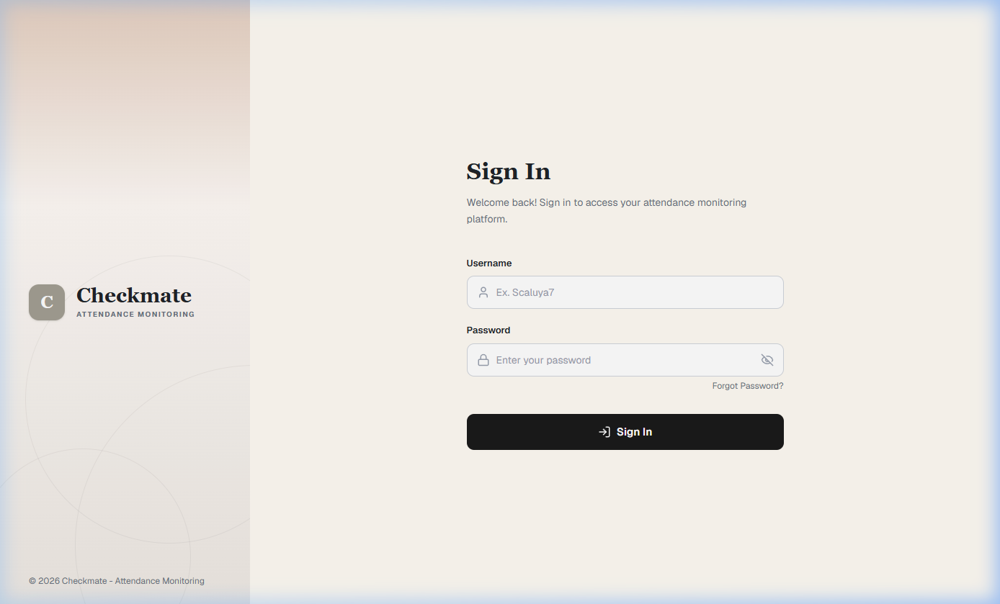
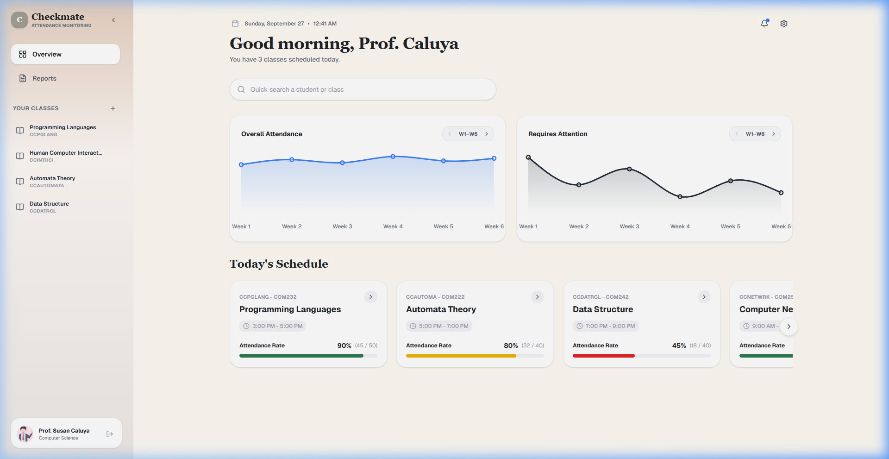
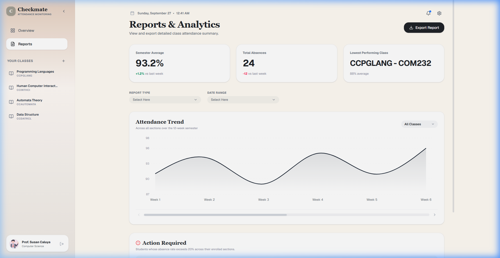
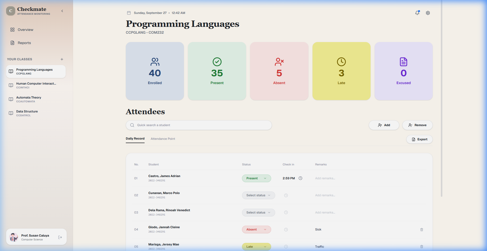

# 🎓 Student Attendance Monitoring System

[](https://github.com/flexycode/CCPGLANG_FINAL_PROJECT)
[](#)
[](LICENSE)

> A final project for **CCPGLANG — Programming Language** that demonstrates the contrast between **JavaScript (Functional Paradigm)** and **Python (Object-Oriented Paradigm)** through a Student Attendance Monitoring System.

---

## 📋 Table of Contents

- [About the Project](#-about-the-project)
- [Screenshots](#-screenshots)
- [Team Members](#-team-members---artificial-ledger)
- [Tech Stack & Paradigms](#-tech-stack--paradigms)
- [Key Features](#-key-features)
- [Project Structure](#-project-structure)
- [Timeline](#-timeline)
- [Getting Started](#-getting-started)
- [Deployment](#-deployment)
- [License](#-license)

---

## 📖 About the Project

The **Student Attendance Monitoring System** is designed to track and manage student attendance records in an academic setting. This project serves as a practical demonstration of how **two different programming languages** — each using a **different programming paradigm** — approach the same problem domain.

### Objective

- Demonstrate how **TypeScript + React** solves attendance tracking using **Functional Programming** (pure functions, immutability, composition)
- Demonstrate how **Python** solves the same problem using **Object-Oriented Programming** (classes, encapsulation, methods)
- Document and explain every function/method with detailed purpose and paradigm-specific rationale

---

## 📸 Screenshots

### Sign In Page


### Dashboard / Overview


### Reports


### Class Details & Attendance


---

## 👥 Team Members — Artificial Ledger

| # | Avatar | Name | Role | GitHub |
|---|--------|------|------|--------|
| 1 |  | **TALOSIG, JAY ARRE PIANO** | 🏆 Project Leader | [](https://github.com/flexycode) |
| 2 |  | **CASTRO, JAMES ADRIAN BEER** | Member | [](https://github.com/phantom-nightmare-code) |
| 3 |  | **CUNANAN, MARCO POLO MOLINA FEBRERO** | Member | [](#) |
| 4 |  | **DELA RAMA, RINOAH VENEDICT B** | Member | [](https://github.com/Noah-dev2217) |
| 5 |  | **GLODO, JANNAH CLEINE TIBOR** | Member | [](https://github.com/jncln) |
| 6 |  | **MARISGA, JERSEY MAE DELA PAZ** | Member | [](https://github.com/jmarisga) |
| 7 |  | **POSERIO, JED NATHAN BUSTAMANTE** | Member | [](#) |

> **Note:** GitHub profile links with `#` and ghost avatars are placeholders. Team members should update with their actual GitHub profile URLs.

---

## 🛠 Tech Stack & Paradigms

| Component | Technology | Paradigm | Purpose |
|-----------|------------|----------|---------|
| **Frontend** | TypeScript + React + Vite | Functional Programming | UI rendering, state management via hooks & pure functions, attendance calculations using `map`, `filter`, `reduce` |
| **Backend** | Python + FastAPI | Object-Oriented Programming | Data modeling via SQLAlchemy ORM classes, encapsulated business logic, method-based analytics |
| **Database** | Supabase (PostgreSQL) / SQLite | — | Persistent storage for students, attendance records, notifications, and settings |
| **Styling** | Tailwind CSS v4 + shadcn/ui | — | Utility-first styling, pre-built accessible UI components |
| **Charts** | Recharts | — | Interactive attendance analytics and data visualizations |
| **Design** | Figma | — | UI/UX wireframes and prototyping |
| **Deployment** | Render | — | Cloud hosting with Infrastructure-as-Code (`render.yaml`) |

### Paradigm Comparison at a Glance

```
┌─────────────────────────────────────────────────────────────────────┐
│                     SAME PROBLEM DOMAIN                            │
│              Student Attendance Monitoring System                   │
├──────────────────────────────┬──────────────────────────────────────┤
│    TypeScript + React        │          Python                     │
│    (Functional Paradigm)     │     (OOP Paradigm)                  │
├──────────────────────────────┼──────────────────────────────────────┤
│  Pure functions              │  Classes & Objects                  │
│  Immutable state             │  Mutable internal state             │
│  Function composition        │  Method chaining                    │
│  Higher-order functions      │  Encapsulation                      │
│  useState / useReducer       │  self attributes                    │
│  No side effects             │  Stateful methods                   │
└──────────────────────────────┴──────────────────────────────────────┘
```

---

## ✨ Key Features

### Attendance Status Tracking

| Status | Description |
|--------|-------------|
| ✅ **Present** | Student attended the class session |
| ❌ **Absent** | Student did not attend with no valid excuse |
| ⏰ **Late** | Student arrived after the designated cutoff time |
| 📋 **Excused** | Student absent with an approved valid excuse |

### Student Status Management

| Status | Description |
|--------|-------------|
| 🟢 **Regular / Enrolled** | Actively enrolled and attending classes |
| 🟡 **Late Enrolled** | Enrolled after the official enrollment period |
| 🔴 **Dropped Out** | Voluntarily or involuntarily removed from the class |
| ⛔ **Suspended** | Temporarily barred from attending |

### Time Tracking

- **Time In** — Logs the exact timestamp when a student arrives / checks in
- **Time Out** — Logs the exact timestamp when a student leaves / checks out

### Attendance Analytics & Calculated Metrics

| Metric | Description | Formula |
|--------|-------------|---------|
| **Total Present** | Number of days marked present | `count(status == "present")` |
| **Total Absent** | Number of days marked absent | `count(status == "absent")` |
| **Total Excused** | Number of excused absences | `count(status == "excused")` |
| **Total Days Attended** | Days physically in class | `total_present + total_late` |
| **Total School Days** | All scheduled class days | `count(all_scheduled_days)` |
| **Attendance Percentage** | Overall attendance rate | `(days_attended / school_days) × 100` |
| **Absence Percentage** | Overall absence rate | `(total_absent / school_days) × 100` |
| **Late Percentage** | Rate of tardiness | `(total_late / school_days) × 100` |
| **Consecutive Absences** | Longest absence streak | Max sequential absent days |
| **Consecutive Lates** | Longest late streak | Max sequential late days |

> 📝 Each metric above is implemented in **both TS (functional)** and **Python (OOP)** with detailed inline documentation explaining the paradigm-specific approach.

### Additional Features

- 🔔 **Notifications System** — In-app notification bell with real-time alerts
- ⚙️ **Settings Modal** — Configurable system preferences (avatar upload, theme, etc.)
- 📊 **Reports Page** — Exportable attendance summaries with charts and tables
- 📅 **Date & Calendar Picker** — Interactive date selection with `react-day-picker`
- 🏫 **Multi-Class Management** — Add, remove, and switch between multiple classes in the sidebar
- 🔐 **Authentication** — Sign-in page with session management

---

## 📁 Project Structure

```text
CCPGLANG_FINAL_PROJECT/
├── 📄 README.md                          # Project documentation (this file)
├── 📄 LICENSE                            # MIT License
├── 📄 .env.example                       # Environment variable template
├── 📄 .gitignore                         # Git ignore rules
├── 📄 render.yaml                        # Render deployment blueprint
├── 📄 attendance.db                      # SQLite fallback database
├── 📄 supabase_schema_and_seed.sql       # Supabase schema & seed data
│
├── 📂 docs/                              # Manuscript & documentation
│   ├── manuscript.md                     # Full written manuscript
│   ├── paradigm-comparison.md            # Side-by-side code comparisons
│   ├── qa_report.md                      # QA testing report
│   ├── 📂 agentic-tasks/                 # Agentic tasks and walkthroughs
│   │   └── walkthrough.md                # Step-by-step walkthrough
│   └── 📂 figures/                       # Screenshots & diagrams
│       ├── signin_page.png               # Sign-in page screenshot
│       ├── dashboard_page.png            # Dashboard overview screenshot
│       ├── reports_page.png              # Reports page screenshot
│       └── class_detail_page.png         # Class detail page screenshot
│
├── 📂 frontend/                          # TypeScript + React (Functional Paradigm)
│   ├── 📄 index.html                     # HTML entry point
│   ├── 📄 package.json                   # Node.js dependencies & scripts
│   ├── 📄 vite.config.ts                 # Vite build configuration
│   ├── 📄 tsconfig.json                  # TypeScript configuration
│   ├── 📄 tsconfig.app.json              # App-specific TS config
│   ├── 📄 tsconfig.node.json             # Node-specific TS config
│   ├── 📄 components.json                # shadcn/ui component config
│   ├── 📂 public/                        # Static assets served as-is
│   │   ├── favicon.svg                   # App favicon
│   │   ├── icons.svg                     # SVG icon sprites
│   │   └── 📂 images/                    # Static images (teacher avatar, etc.)
│   └── 📂 src/                           # Application source code
│       ├── App.tsx                        # Main React app component (routing & auth)
│       ├── main.tsx                       # React entry point (DOM mount)
│       ├── index.css                      # Global styles & Tailwind imports
│       ├── overview.tsx                   # Dashboard / Overview page
│       ├── reports.tsx                    # Reports & analytics page
│       ├── classDetails.tsx              # Class detail & attendance marking page
│       ├── 📂 assets/                    # Bundled images & icons
│       │   ├── hero.png                  # Hero illustration
│       │   ├── react.svg                 # React logo
│       │   └── vite.svg                  # Vite logo
│       ├── 📂 components/                # Reusable React components
│       │   ├── LoginForm.tsx             # Sign-in form component
│       │   ├── SidePanel.tsx             # Sign-in page branding panel
│       │   ├── Sidebar.tsx               # Main app sidebar navigation
│       │   ├── HeaderDate.tsx            # Top bar with date, search & notifications
│       │   ├── NotificationsModal.tsx    # Notification bell dropdown
│       │   ├── SettingsModal.tsx         # Settings dialog (avatar, preferences)
│       │   └── 📂 ui/                    # Base UI primitives (shadcn/ui)
│       │       ├── button.tsx            # Button component
│       │       ├── calendar.tsx          # Calendar picker component
│       │       ├── card.tsx              # Card layout component
│       │       ├── chart.tsx             # Chart wrapper (Recharts)
│       │       ├── chart-area-gradient.tsx # Area chart with gradient fill
│       │       ├── combobox.tsx          # Searchable dropdown component
│       │       ├── dialog.tsx            # Modal dialog component
│       │       ├── input.tsx             # Text input component
│       │       ├── input-group.tsx       # Grouped input component
│       │       ├── popover.tsx           # Popover component
│       │       ├── textarea.tsx          # Textarea component
│       │       ├── time-picker.tsx       # Time picker component
│       │       └── toast.tsx             # Toast notification component
│       └── 📂 lib/                       # Shared utilities
│           └── utils.ts                  # Utility functions (cn helper)
│
├── 📂 backend/                           # Python FastAPI (OOP Paradigm)
│   ├── 📄 main.py                        # FastAPI application entry point
│   ├── 📄 database.py                    # SQLAlchemy engine & session setup
│   ├── 📄 db_models.py                   # SQLAlchemy ORM models (Student, Attendance, etc.)
│   ├── 📄 schemas.py                     # Pydantic models for request/response validation
│   ├── 📄 requirements.txt              # Python dependencies
│   └── 📂 api/                           # API endpoint routers
│       ├── __init__.py                   # Router package init
│       ├── analytics.py                  # GET analytics & metrics endpoints
│       ├── attendance.py                 # POST/PUT attendance marking endpoints
│       ├── auth.py                       # POST authentication endpoints
│       ├── notifications.py             # GET/POST notification endpoints
│       ├── settings.py                   # GET/PUT system settings endpoints
│       ├── students.py                   # CRUD student management endpoints
│       └── system.py                     # System-level endpoints (health, time, etc.)
│
└── 📂 figma/                             # Figma design assets & exports
    └── 📂 exports/                       # Exported design screens
```

---

## 📅 Timeline

| Week | Focus | Key Deliverables |
|------|-------|-----------------|
| **Week 1** (Sep 8–14) | Research, Design & Docs Foundation | Figma wireframes, manuscript outline, feature docs |
| **Week 2** (Sep 15–21) | Python OOP Backend | Working backend, FastAPI routes, OOP manuscript section |
| **Week 3** (Sep 22–28) | TS + React Frontend | Working frontend, Figma-to-code, Functional manuscript section |
| **Week 4** (Sep 29–Oct 6) | Integration, Polish & Submission | Complete system, final manuscript, demo, GitHub release |

---

## 🚀 Getting Started

### Prerequisites

- **Node.js** v18+ — [Download](https://nodejs.org/)
- **Python** v3.10+ — [Download](https://www.python.org/downloads/)
- **npm** (bundled with Node.js)

### 1. Clone the Repository

```bash
git clone https://github.com/flexycode/CCPGLANG_FINAL_PROJECT.git
cd CCPGLANG_FINAL_PROJECT
```

### 2. Set Up Environment Variables

```bash
# Copy the example and fill in your Supabase credentials
cp .env.example .env
```

> If no `.env` is set, the backend will automatically fall back to a local SQLite database (`attendance.db`).

### 3. Backend (Python FastAPI)

```bash
# Create and activate virtual environment (Windows)
python -m venv venv
.\venv\Scripts\activate

# Install dependencies
pip install -r backend\requirements.txt

# Run the API server (http://127.0.0.1:8000)
uvicorn backend.main:app --reload
```

### 4. Frontend (TypeScript + React)

```bash
# In a separate terminal
cd frontend
npm install
npm run dev
# Frontend runs at http://localhost:5173
```

### 5. Access the Application

| Service | URL |
|---------|-----|
| **Frontend** | http://localhost:5173 |
| **Backend API** | http://127.0.0.1:8000 |
| **API Docs (Swagger)** | http://127.0.0.1:8000/docs |

---

## ☁️ Deployment

This project includes a **Render Blueprint** (`render.yaml`) for one-click cloud deployment:

1. Push your code to GitHub
2. Go to [render.com/deploy](https://render.com/deploy)
3. Connect this repository
4. Set the `SUPABASE_DB_URL` environment variable in the Render Dashboard

> See [`render.yaml`](render.yaml) for the full Infrastructure-as-Code configuration.

---

## 📜 License

This project is licensed under the MIT License — see the [LICENSE](LICENSE) file for details.

---

<p align="center">
  <b>Artificial Ledger</b> · CCPGLANG — Programming Language · COM232
</p>
